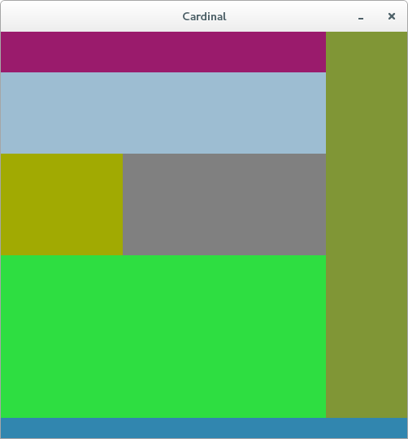

# Cardinal
simple gui element spacing



Layout used in this example:
```
split s, 0.05
split e, 0.2
split s, 0.4
split n, 0.1
split n, 0.2
split w, 0.3
```
## Purpose
Generate element spacings for simple programs in a way that is robust and covers
most non-complicated use cases. Easily integrate with other tools by maintaining
a small feature scope and creating output that can be used anywhere.

## Usage
```python
import cardinal

SIZE = 300, 200
LAYOUT = """
split N, 0.2
split S, 0.1
split E, 0.3
split W, 0.01
"""

interface = cardinal.Interface(LAYOUT, SIZE)
vertices, vertex_colors = interface.render()
```

## Details
Cardinal takes a list of elements, called 'splits', and produces numpy arrays of
vertices, for direct use with opengl. Each split is a combination of one
cardinal direction--north, south, east, or west--and a decimal number between
0.0 and 1.0 representing the percentage of screen size. Elements are anchored to
one side of the screen. Elements are added in order: if a new 'E' split is
added, and another 'E' split is already present, the new split will stack with
the old one, relative to the edge of the screen.
